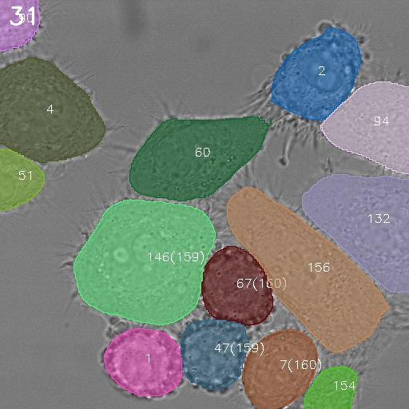

[](https://opensource.org/licenses/BSD-2-Clause)
[](https://github.com/TimoK93/ctc-metrics/actions/workflows/pylint.yml)
[](https://github.com/TimoK93/ctc-metrics/actions/workflows/python-package.yml)
[](https://github.com/CellTrackingChallenge/py-ctcmetrics/actions/workflows/publish.yml)

# Py-CTCMetrics
A python implementation of the metrics used in the paper 
[CHOTA: A Higher Order Accuracy Metric for Cell Tracking](...) by 
*Kaiser et al.*. The code is
designed to evaluate tracking results in the format of the
[Cell-Tracking-Challenge](https://celltrackingchallenge.net/) but can also be used 
for custom results. 
The repository contains the metrics of the
[Cell-Tracking-Challenge](https://celltrackingchallenge.net/),
the [MOTChallenge](https://motchallenge.net/), and the
[CHOTA](...) metric.

Detailed descriptions of the metrics can be found in the [paper](...).

---

## Features at a Glance

- **Validation**: Check if the tracking results are correctly formatted.
- **Evaluation**: Evaluate the tracking results with respect to the ground truth using CTC, MotChallenge, and CHOTA metrics.
- **Visualization**: Visualize the tracking results.
- **Video Creation**: Create a video of the visualized tracking results for presentation purposes.
- **Noise Evaluation**: Evaluate the impact of specific errors on the evaluation metrics.
 
---

## Requirements

We tested the code with **Python 3.10**. Additional packages that will be 
installed automatically are listed in the [requirements.txt](requirements.txt).

---

## Installation

The package can be installed via pip:

```bash
pip install py-ctcmetrics
```

or from the source code:

```bash
git clone https://github.com/CellTrackingChallenge/py-ctcmetrics
cd py-ctcmetrics
pip install .
```

---

## Usage


The package supports validation, evaluation, and visualization of tracking 
results. The following examples are shown for an example directory that is 
structured in the CTC-format as follows:

```bash
ctc
├── train
│   ├── challenge_x
│   │   ├── 01_GT
│   │   ├── 01_RES
│   │   ├── 02_GT
│   │   ├── 02_RES
│   ├── challenge_y 
│   │   ├── 01_GT
│   │   ├── 01_RES
│   │   ├── 02_GT
│   │   ├── 02_RES
```
The directory ```ctc```  contains the training data. The subdirectories 
```challenge_x``` and ```challenge_y``` contain the data for the different
challenges. Each challenge directory contains subdirectories for the sequences
```01_GT```, ```01_RES```, ```02_GT```, and ```02_RES```. The directories 
```01_GT``` and ```01_RES``` contain the ground truth and the tracking results
for the sequence ```01```. The same applies to the directories ```02_GT``` and
```02_RES```.


### Validation

Produced tracking results can be invalid due to various reasons. To check if
the tracking results are correctly formatted according to the CTC-format, the
```ctc_validate``` command can be used. The command checks if the tracking
results are correctly formatted. There is no ground truth needed for this
validation.

To validate if ```challenge_x/01``` is correctly formatted, run the 
command
```bash
ctc_validate --res "/ctc/train/challenge_x/01_RES"
```
Moreover, you can recursively validate the tracking results for all 
challenges/sequences in a directory by adding the flag ```-r```:
```bash
ctc_validate --res "/ctc/train" -r
```
In this example, all four sequences will be validated.

### Evaluation

To evaluate results against the ground truth, similar commands can be used. 
For example, to evaluate the sequence ```challenge_x/01```, run the command
```bash 
ctc_evaluate --gt "/ctc/train/challenge_x/01_GT" --res "/ctc/train/challenge_x/01_RES"
```
or recursively for all sequences in a directory:
```bash
ctc_evaluate --gt "/ctc/train" --res "/ctc/train" -r
```
The ```gt``` argument specifies the path to the ground truth directory, and the
```res``` argument specifies the path to the results directory. The flag ```-r```
recursively evaluates all sequences in the directory.

Per default, the code is executed using multiple processes with one process per 
available CPU core. Multiprocessing decreases the execution time but also 
increases
the memory consumption. If you need to set the maximal number of processes,
the number of processes can be specified with the argument 
```--num-threads``` or ```-n```:
```bash
ctc_evaluate --gt "/ctc/train" --res "/ctc/train" -r -n 4
```

The evaluation results are printed to the console. If you want to save the
results to a csv file, you can use the argument ```--csv-file``` :
```bash
ctc_evaluate --gt "/ctc/train" --res "/ctc/train" -r --csv-file "/ctc/results.csv"
```
**Note:** The csv file will be overwritten if it already exists!

The following table shows the available arguments:

| Argument      | Description                                          | Default |
|---------------|------------------------------------------------------| --- |
| --gt          | Path to the ground truth directory.                  | None |
| --res         | Path to the results directory.                       | None |
| --recursive   | Recursively evaluate all sequences in the directory. | False |
| --csv-file    | Path to a csv file to save the results.              | None |
| --num-threads | Number of threads to use for evaluation.             | 1    |

Per default, all given metrics are evaluated. You can also select the metrics
you are interested in to avoid the calculation of metrics that are not in your 
interest. Additional arguments to select a subset of specific metrics are:

| Argument | Description                                                     | 
| --- |-----------------------------------------------------------------|
| --valid | Check if the result has valid format                            | 
| --det | The DET detection metric                                        |
| --seg | The SEG segmentation metric                                     |
| --tra | The TRA tracking metric                                         |
| --lnk | The LNK linking metric                                          |
| --ct | The CT (complete tracks) metric                                 |
| --tf | The TF (track fraction) metric                                  |
| --bc | The BC(i) (branching correctness) metric                        |
| --cca | The CCA (cell cycle accuracy) metric                            |
| --mota | The MOTA (Multiple Object Tracking Accuracy) metric             |
| --hota | The HOTA (Higher Order Tracking Accuracy) metric                |
| --idf1 | The IDF1 (ID F1) metric                                         |
| --chota | The CHOTA (Cell-specific Higher Order Tracking Accuracy) metric |
| --mtml | The MT (Mostly Tracked) and ML (Mostly Lost) metrics            |
| --faf | The FAF (False Alarm per Frame) metric                          |
---

To use the evaluation protocol in your python code, the code can be imported
as follows:

```python   
from ctc_metrics import evaluate_sequence, validate_sequence

# Validate the sequence
res = validate_sequence("/ctc/train/challenge_x/01_RES")
print(res["Valid"])

# Evaluate the sequence
res = evaluate_sequence("/ctc/train/challenge_x/01_GT", "/ctc/train/challenge_x/01_RES")
print(res["DET"])
print(res["SEG"])
print(res["TRA"])
...
    
```

### Visualization

<p align="center">
  
</p>


You can visualize your tracking results with the following command:

```bash
ctc_visualize --img "/ctc/train/challenge_x/01" --res "/ctc/train/challenge_x/01_RES"
```

The command will show the visualizations of the tracking results. You can 
control the visualization with specific keys:


| Key   | Description                                                         | 
|-------|---------------------------------------------------------------------| 
| q     | Quits the Application                                               |  
| w     | Start or Pause the auto visualization                               |
| d     | Move to the next frame                                              |
| a     | Move to the previous frame                                          |
| l     | Toggle the show labels option                                       |
| p     | Toggle the show parents option                                      |
| s     | Save the current frame to the visualization directory as .jpg image |


There are additional arguments that can be used to specify the visualization. 
The following table shows the available arguments:


| Argument          | Description                                                                              | Default |
|-------------------|------------------------------------------------------------------------------------------|---------|
| --img             | The directory to the images **(required)**                                               |         |
| --res             | The directory to the result masks **(required)**                                         |         |
| --viz             | The directory to save the visualization                                                 | None    |
| --video-name      | The path to the video if a video should be created                                       | None    |
| --border-width    | The width of the border. Either an integer or a string that describes the challenge name | None    |
| --show-no-labels  | Print no instance labels to the output as default                                        | False   |
| --show-no-parents | Print no parent labels to the output as default                                          | False   |
| --ids-to-show     | The IDs of the instances to show. If defined, all others will be ignored.                | None    |
| --start-frame     | The frame to start the visualization                                                     | 0       |
| --framerate       | The framerate of the video                                                               | 10      |
| --opacity         | The opacity of the instance colors                                                       | 0.5     |

**Note:** The argument `--video-name` describes a path to a video file. The file
extension needs to be `.mp4`. If a video name is selected be created, 
the visualization is not shown on the screen. Please use the arguments to
specify your visualization settings such as the opacity, border width etc. 

### Impact of Errors and Noise on the Evaluation Metrics

The evaluation metrics are sensitive to errors in the tracking results. To
investigate the impact of detection and association errors on your dataset with 
respect to the evaluation metrics, the repository provides a script to 
automatically run the evaluation with different noise levels. The script uses
the ground truth of the data as oracle tracking result. Then, noise is
added to the oracle tracking results and the evaluation metrics are calculated
for the noisy tracking results. The scripts independently evaluates the 
influence of randomly inserted false positives, false negatives, ID switches,
and removals of correct result-to-reference matches.
The results are stored into a predefined csv file. The script can be used as 
follows:

```bash
ctc_noise --gt "/ctc/train/challenge_x/01_GT" --csv-file "/ctc/noise_experiments.csv"
```

Similar to the validation and evaluation scripts, the script can be used
recursively for all sequences in a directory by adding the flag ```-r```. 
Moreover, the number of threads can be specified with the argument 
```--num-threads``` or ```-n```. Since metrics are sometimes prone to randomness
in the distribution of the errors, the script can be run multiple times with
different seeds to get a more robust evaluation. The number of seeds can be
specified with the argument ```--repeat```.

The following table shows the available arguments:

| Argument      | Description                                                        | Default |
|---------------|--------------------------------------------------------------------| --- |
| --gt          | Path to the ground truth directory.                                | None |
| --csv-file    | Path to a csv file to save the results.                            | None |
| --recursive   | Recursively evaluate all sequences in the directory.               | False |
| --num-threads | Number of threads to use for evaluation.                           | 1    |
| --repeats     | Number of repeats to run the evaluation.                           | 1    |
| -- num-false-pos | Number of false positive instances to add to the tracking results. | 500 |
| -- num-false-neg | Number of false negative instances to add to the tracking results. | 500 |
| -- num-idsw      | Number of ID switches to add to the tracking results.              | 500 |
| -- num-matches   | Number of matches to add to the tracking results.                  | 500 |
| -- save-after    | Save the intermediate results after a specific number of runs.    | 100 |


---

## Notes

- If you only have segmentation results and want to evaluate the *SEG* metric,
it is important that you pass the *--seg* flag to the evaluation command. 
Otherwise, the code could flag your input as invalid, because the 
*res_track.txt* file is missing or inconsistent.

---

## Contributing

Contributions are welcome! For bug reports or requests please
[submit an issue](www.github.com/TimoK93/ctc-metrics/issues). For new features
please [submit a pull request](www.github.com/TimoK93/ctc-metrics/pulls).

If you want to contribute, please check your code with pylint and the
pre-commit hooks before submitting a pull request:

```bash
pip install pre-commit, pylint
pre-commit run --all-files
```

---

## Acknowledgement and Citations

The code was developed by Timo Kaiser on behalf of the [Institute of Information
Processing](https://www.tnt.uni-hannover.de/) at the Leibniz University Hanover in conjunction with the 
organizers of the [Cell-Tracking-Challenge](https://celltrackingchallenge.net/).


If you use this code or the CHOTA metric in your research, please cite the following paper:
```bibtex
@inproceedings{kaiser2024chota,
    author = {Kaiser, Timo and Ulman, Vladimír and Rosenhahn, Bodo},
    title = {CHOTA: A Higher Order Accuracy Metric for Cell Tracking},
    booktitle = {European Conference on Computer Vision Workshops (ECCVW)},
    year = {2024},
    organization={Springer}
}
```

If you use CTC-Metrics (BC, CT, CCA, TF, SEG, TRA, DET, LNK) in your research, please cite the following paper:
```bibtex
@article{thecelltrackingchallenge,
    author = {Maška, Martin and Ulman, Vladimír and Delgado-Rodriguez, Pablo and Gómez de Mariscal, Estibaliz and Necasova, Tereza and Guerrero Peña, Fidel Alejandro and Ing Ren, Tsang and Meyerowitz, Elliot and Scherr, Tim and Löffler, Katharina and Mikut, Ralf and Guo, Tianqi and Wang, Yin and Allebach, Jan and Bao, Rina and Al-Shakarji, Noor and Rahmon, Gani and Toubal, Imad Eddine and Palaniappan, K. and Ortiz-de-Solorzano, Carlos},
    year = {2023},
    month = {05},
    pages = {1-11},
    title = {The Cell Tracking Challenge: 10 years of objective benchmarking},
    volume = {20},
    journal = {Nature Methods},
    doi = {10.1038/s41592-023-01879-y}
}
```
and
```bibtex
@article{matula2015cell,
  title={Cell tracking accuracy measurement based on comparison of acyclic oriented graphs},
  author={Matula, Pavel and Ma{\v{s}}ka, Martin and Sorokin, Dmitry V and Matula, Petr and Ortiz-de-Sol{\'o}rzano, Carlos and Kozubek, Michal},
  journal={PloS one},
  volume={10},
  number={12},
  pages={e0144959},
  year={2015},
  publisher={Public Library of Science San Francisco, CA USA}
}
```

If you use the HOTA metric in your research, please cite the following paper:
```bibtex
@article{luiten2021hota,
  title={Hota: A higher order metric for evaluating multi-object tracking},
  author={Luiten, Jonathon and Osep, Aljosa and Dendorfer, Patrick and Torr, Philip and Geiger, Andreas and Leal-Taix{\'e}, Laura and Leibe, Bastian},
  journal={International journal of computer vision},
  volume={129},
  pages={548--578},
  year={2021},
  publisher={Springer}
}
```

If you use the IDF1 metric in your research, please cite the following paper:
```bibtex
@inproceedings{ristani2016performance,
  title={Performance measures and a data set for multi-target, multi-camera tracking},
  author={Ristani, Ergys and Solera, Francesco and Zou, Roger and Cucchiara, Rita and Tomasi, Carlo},
  booktitle={European conference on computer vision},
  pages={17--35},
  year={2016},
  organization={Springer}
}
```

If you use the MOTA metric in your research, please cite the following paper:
```bibtex
@article{bernardin2008evaluating,
  title={Evaluating multiple object tracking performance: the clear mot metrics},
  author={Bernardin, Keni and Stiefelhagen, Rainer},
  journal={EURASIP Journal on Image and Video Processing},
  volume={2008},
  pages={1--10},
  year={2008},
  publisher={Springer}
}
```

---

## License

This project is licensed under the BSD 2-Clause License - see the 
[LICENSE](LICENSE.txt) file for details.


